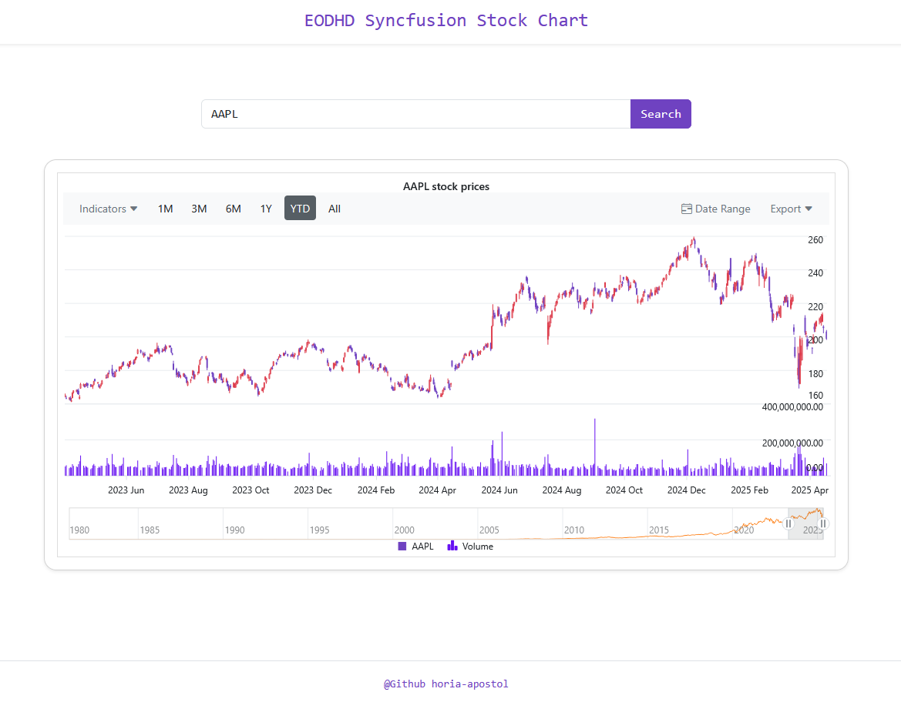

# Blazor Stock Chart Viewer with EODHD and Syncfusion

<p align="left">
  <a href="https://dotnet.microsoft.com/apps/aspnet/web-apps/blazor" target="_blank">
    
  </a>
</p>

Add stock charts to your Blazor .NET 9 applications using the end-of-day market data from the EODHD API and the Syncfusion Stock Chart component.

The project integrates the [Syncfusion Blazor Stock Chart](https://www.syncfusion.com/blazor-components/blazor-stock-chart) with the data fetched from the [EODHD API](https://eodhd.com/financial-apis/api-for-historical-data-and-volumes), 
offering an interactive chart experience for visualizing candle and volume data for any supported stock ticker. 


---

## Overview



---

## Configuration

The backend project `WebAPI` uses EODHD's historical data API, which requires configuration via appsettings.json:

```json
"EodhdSettings": {
  "BaseUrl": "https://eodhd.com/api",
  "ApiToken": "your_api_token"
}
```

By default, the API token is set to "demo" for testing purposes, but you should sign up for a personal API key.

In the Blazor project `WebUI`, Syncfusion components are used to render the interactive stock chart. You must register either a commercial license or a free [community license](https://www.syncfusion.com/products/communitylicense). This is done in Program.cs:

```csharp
Syncfusion.Licensing.SyncfusionLicenseProvider.RegisterLicense("Your Syncfusion License");
```

## API Documentation

The backend exposes a clean API for fetching historical stock prices from EODHD, including support for filtering by period, date range, and sort order.

- Online SwaggerHub docs: [https://app.swaggerhub.com/apis/HoriaApostol/eodhd-syncfusion-chart/1.0.0](https://app.swaggerhub.com/apis/HoriaApostol/eodhd-syncfusion-chart/1.0.0)
- Built-in Swagger UI: [https://localhost:7062/swagger](https://localhost:7062/swagger)
